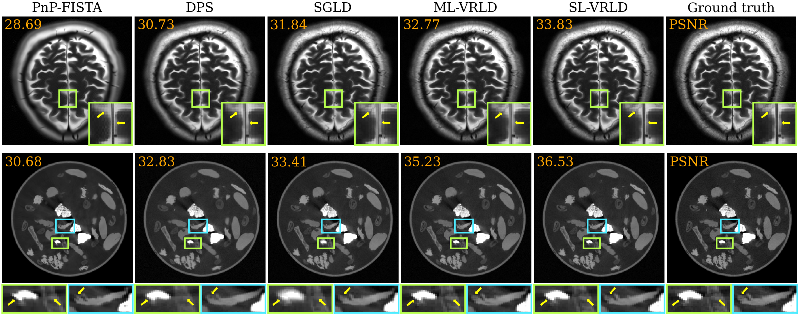

# Variance Reduction for Non-Log-Concave Sampling with Applications to Inverse Problems (UAI 2026)


## Abstract 

Sampling from high-dimensional, non-log-concave distributions with unnormalized densities is a fundamental challenge in machine learning, particularly when the exact gradient of the potential is unavailable and must be approximated via stochastic gradients, which can exhibit high variance under a fixed budget of gradient computations per iteration. Although variance reduction techniques such as SGD with momentum, STORM, and PAGE have demonstrated improved convergence properties in non-convex optimization, their implications for sampling from non-log-concave distributions remain largely unexplored. In this work, we develop the first unified analysis of these estimators for sampling from non-log-concave distributions. We establish non-asymptotic convergence rates in $\varepsilon$-relative Fisher information and in squared total variation distance under a Poincar\'e inequality assumption, and further prove the weak convergence to the target distribution. We extend our analysis to solving inverse problems with score-based generative priors. We empirically validate our theory and demonstrate that under a fixed gradient computations per iteration, variance-reduction techniques consistently improve sample quality in two standard imaging applications. 



## Prerequisities

- python 3.12.5
- pytorch 2.6.0
- CUDA 12.1
- Conda (recommended: Miniconda or Anaconda)

Additional package dependencies and exact environment specifications are provided in `env.yaml`. 

It may be possible to use different CUDA/PyTorch combinations provided they are compatible. 

## Getting Started 

### 1) Clone the repository

```bash
git clone https://github.com/mberk-sahin/variance-reduced-sampling.git

```

### 2) Environment Setup

Create the Conda environment from the provided YAML file:

```bash
conda env create -f env.yaml
conda activate vr-sampling
```

### 3) GMM Experiments

To reproduce the experiments for sampling from Gaussian Mixture Model (GMM), run the following:

```bash
cd ./toy_experiments/numerical_validation
# SGLD (b = 6)
python monte_carlo_gmm8.py --num_runs 20 --gamma 2e-2 --std_noise_grad 30.0 --estimator sgd --batch_size 6 --num_iter 4000 --save_every 20 --save_dir ./results/std30/sgd-b6
# SGLD (b = 72)
python monte_carlo_gmm8.py --num_runs 20 --gamma 2e-2 --std_noise_grad 30.0 --estimator sgd --batch_size 72 --num_iter 4000 --save_every 20 --save_dir ./results/camera-ready/std30/sgd
# ML-VRLD (b = 6, p = 0)
python monte_carlo_gmm8.py --num_runs 20 --gamma 1.5e-3 --std_noise_grad 30.0 --estimator sgdm --beta 0.9 --batch_size 6 --num_iter 4000 --save_every 20 --save_dir ./results/std30/sgdm/beta0p9
# SL-VRLD (b = 6, p = 0)
python monte_carlo_gmm8.py --num_runs 20 --gamma 2e-2 --std_noise_grad 30.0 --estimator storm --beta 0.999 --batch_size 3 --num_iter 4000 --save_every 20 --save_dir ./results/std30/storm/beta0p999
```

### 4) Checkpoints for MRI experiments

For MRI reconstruction experiments, download the checkpoint `fastmri_brain.pth` from [PnP-MonteCarlo](https://github.com/sunyumark/PnP-MonteCarlo). Then, specify the checkpoint path in the base configuration file `./PnP-MonteCarlo/configs/radial_mri/base_unet.yaml` by setting `init_score_fn_dir`.

**Note:** Additional code for sparse-angle CT reconstruction and detailed instructions for running the experiments will be released soon.

## Credits

The implementation of annealed Langevin Monte Carlo sampling under `PnP-MonteCarlo` folders in this repository is partially adapted from the publicly available [PnP-MonteCarlo](https://github.com/sunyumark/PnP-MonteCarlo) codebase. We acknowledge the original authors for their contribution and encourage readers to consult their repository and associated paper for additional methodological and implementation details.


## Citation 

If you find our work interesting, please consider citing 

```
@inproceedings{
sahinm2026vrsampling,
title={Variance Reduction for Non-Log-Concave Sampling with Applications to Inverse Problems},
author={M. Berk Sahin and Behzad Sharif and Abolfazl Hashemi},
booktitle={Forty-Second Annual Conference on Uncertainty in Artificial Intelligence},
year={2026},
url={https://openreview.net/forum?id=FgBIoCyrmk}
}
```